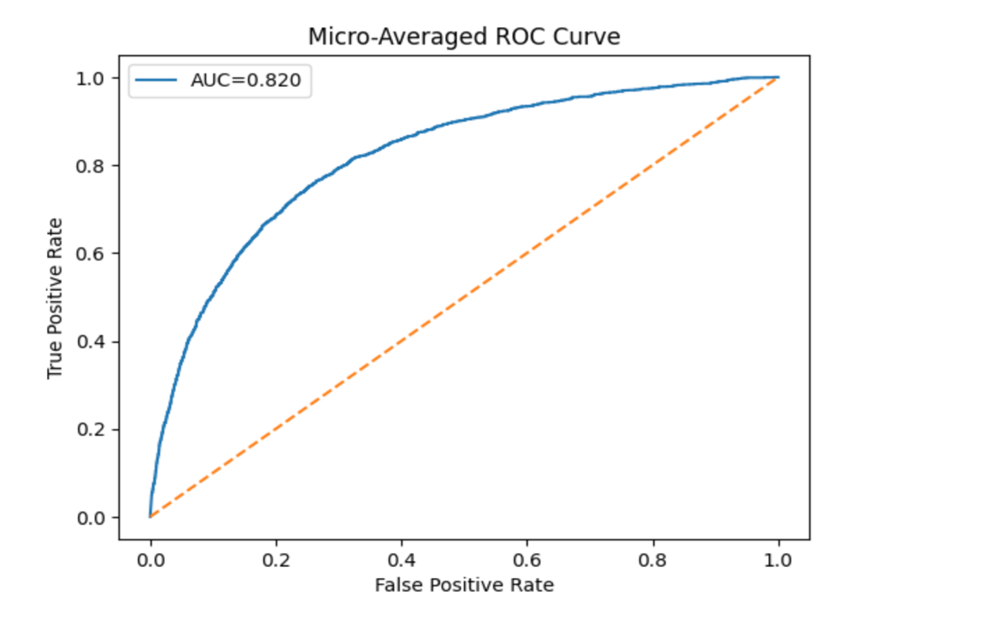
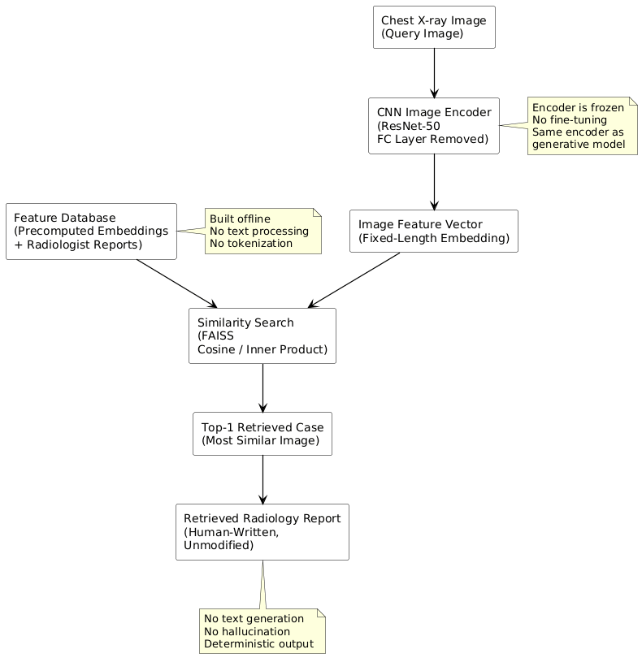
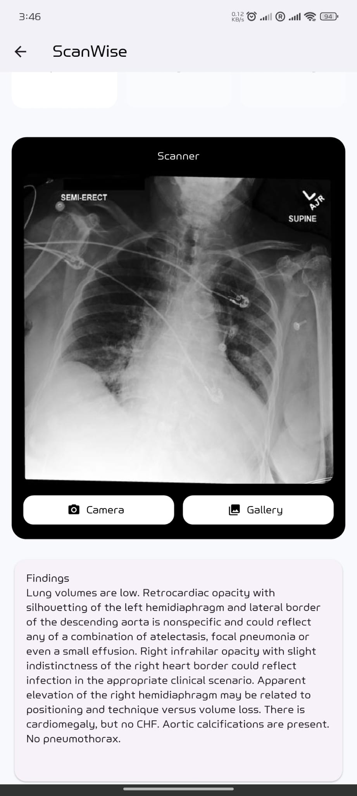
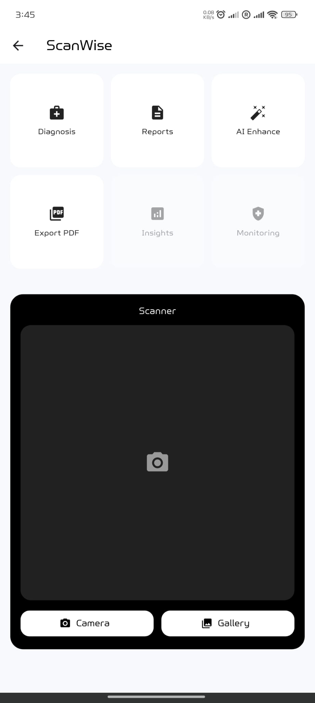
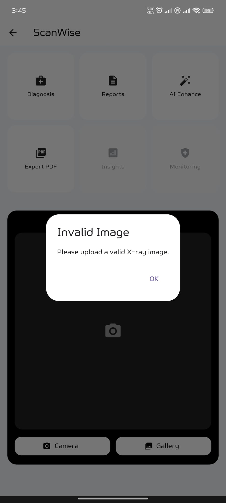
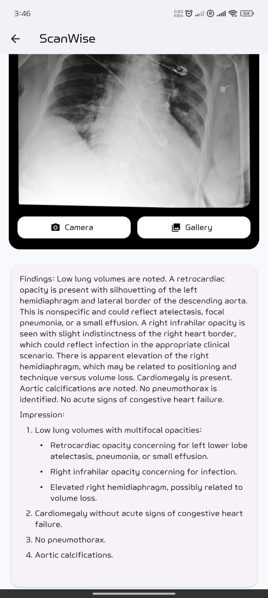

# ScanWise 🩻

**On-device chest X-ray screening using retrieval-based machine learning.**

A Flutter app that runs chest X-ray report retrieval entirely on the device via ONNX Runtime — no server, no image upload. Built as my MSc Computer Science (AI Pathway) dissertation at the University of Suffolk (Distinction), supervised by Dr Hisham Jaward.

> ⚠️ **Research project — not a medical device.** ScanWise is not certified for clinical use and must not be used for diagnosis. It exists to compare report-generation strategies for medical imaging and demonstrate safe deployment on mobile hardware.

---

## The core finding: retrieval beats generation for clinical grounding

Free-text generative models produce fluent radiology reports — and hallucinate findings that are not in the image. My dissertation compared a generative pipeline against a retrieval-based one using the **same frozen ResNet-50 encoder**, so the only variable was the text strategy. Clinical grounding was measured with a multi-label probing classifier rather than text-similarity scores, which can miss clinical errors.

| Metric (clinical probing) | Generative (ResNet→LSTM) | **Retrieval (this app)** |
|---|---|---|
| Micro-F1 | 0.214 | **0.841** |
| Macro-F1 | 0.194 | **0.315**† |
| ROC-AUC (micro) | 0.432 | **0.820** |

<sub>† estimated from per-class F1 curves (dissertation Fig. 20).</sub>



**Why it matters:** in safety-critical reporting, traceability beats fluency. Retrieval returns reports from real, labelled cases — deterministic, inspectable, and unable to invent findings. The dissertation's conclusion: deploy the safer method.

## How it works



1. **Encode** — the input X-ray is embedded by a ResNet-50 (final FC layer removed) exported to ONNX, running on-device via ONNX Runtime.
2. **Guard** — a grayscale similarity check rejects non-X-ray inputs before inference.
3. **Retrieve** — cosine similarity over L2-normalised embeddings finds the closest cases in a precomputed index of the training set (FAISS-accelerated offline; flat index on device).
4. **Refine** — a constrained Gemini agent rewrites the retrieved report for readability **only**. It is prompted never to add, remove, or alter findings — the clinical content stays grounded in the retrieved case.

No image ever leaves the phone. Only the optional refinement step calls an external API, and it sends retrieved report text, not the image.

<p float="left">
  
  
  
  
</p>

*Home · Retrieval-based findings · AI refinement · Input guard rejecting a non-X-ray image*

## Dataset

Trained and evaluated on the MedViLL-curated chest X-ray report dataset: **89,395 train / 759 validation / 1,531 test** image–report pairs, multi-label findings with strong class imbalance. The dataset is **not redistributed** here per its licence — obtain it from the official source. No patient-identifiable data is included in this repository.

## Getting started

1. Clone the repo.
2. Download the model artifacts from the [latest Release](../../releases/latest) — `embedder.onnx` and `train_embs.f32` — and place them in `assets/models/`.
3. Supply your own Gemini API key for the (optional) refinement step:

```bash
flutter pub get
flutter run --dart-define=GEMINI_API_KEY=your_key_here
```

The app runs without a key; refinement is simply disabled.

## Project structure

```
lib/            Flutter app: UI, preprocessing, ONNX inference, retrieval
assets/models/  Model artifacts (download from Releases)
docs/           Screenshots and result figures
test/           Tests
```

## Limitations & future work

Retrieval cannot return findings absent from the reference set; evaluation is single-dataset, so cross-hospital generalisation is untested; and clinical validation with radiologist review has not been performed. Future directions: hybrid retrieval + constrained generation, larger reference databases, and additional imaging modalities.

## Author

**Rizwan Hussain** — Senior Backend Engineer (Java/Spring Boot) who also ships production Flutter apps.
[GitHub](https://github.com/rizwanhussain98) · [LinkedIn](https://www.linkedin.com/in/rizwanhussain98/) · rizwanhussain.dev@gmail.com

## Licence

MIT — see [LICENSE](LICENSE). Model artifacts and the dataset carry their own terms.
